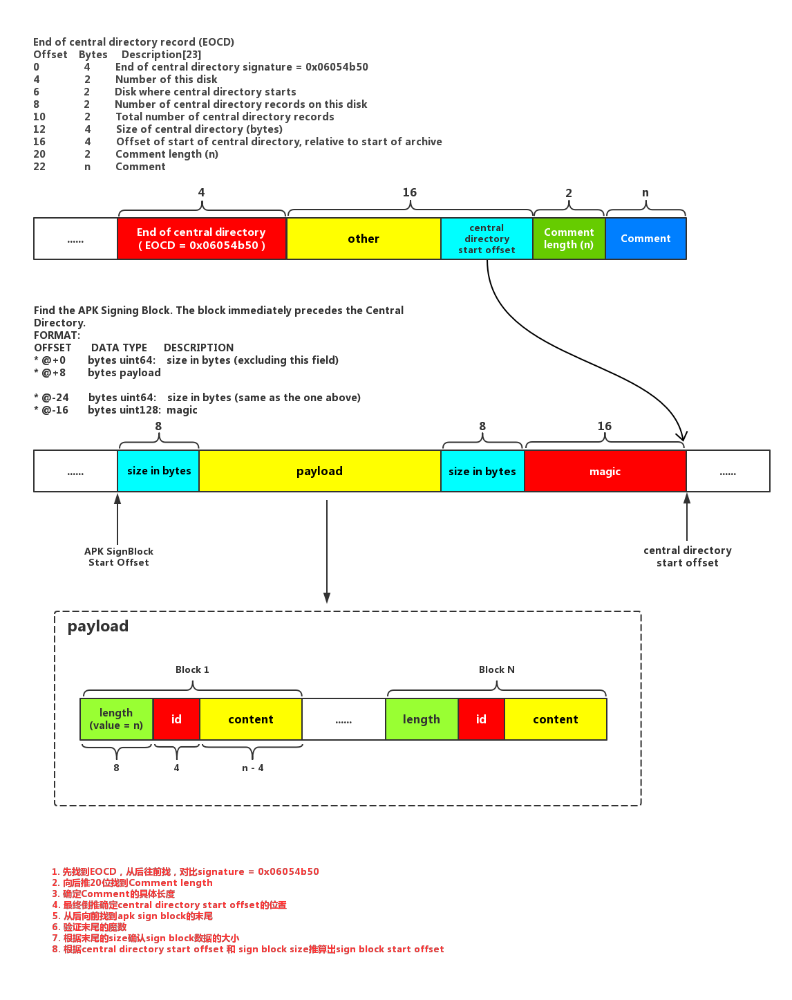

# NPacker
## 提纲
* NPacker实现的原理 apk sign v2
    * sign v2版本Apk的内部结构
    * 如何在修改Apk的情况下不破坏签名的合法性
* NPacker具体实现
    * Task的依赖创建，extensions的创建
    * InjectTask的实现
    * 渠道信息的注入
        * 根据apk文件找到End Of Central Directory (0x06054b50)
        * 根据EOCD找到Central Directory Start Offset
        * 根据Central Directory找到Sign Block
        * 读取Sign Block中原有的Payload
        * 加入合并新的自定义的Payload
        * 重新写回到Sign Block中
        * 恢复Central Directory Start往后的所有数据，刷新EOCD中的Central Directory Start Offset字段
* NPacker后续需要改进点 future
    * PayloadSupport和ApkSupport的职责划分
    * 日志权限的统一
    * python脚本的实现版本
    * python脚本的读取渠道信息版本
    
## NPacker实现的原理
### Android 签名机制
[Android 签名机制](./doc/AppSignNote.md)

### APK Sign v2
Android APK在Sign v1版本的时候是标准的ZIP文件，签名信息都放在了META-INF中，而在Sign v2版本的时候APK文件中多了一块Sign Block的数据区块


Sign v2签名把整个APk文件分成若干个chunk，然后对chunk进行签名，最后再将这些chunk签名汇总在进行一次签名，最后将签名信息保存到Sign Block块中。APK中第一三四块数据都会受到签名的保护，确保不被篡改。


> Protection of section 4 (ZIP End of Central Directory) is complicated by the section containing the offset of ZIP Central Directory. The offset changes when the size of the APK Signing Block changes, for instance, when a new signature is added. Thus, when computing digest over the ZIP End of Central Directory, the field containing the offset of ZIP Central Directory must be treated as containing the offset of the APK Signing Block.

官方文档中提到第四部分End of Central Directory比较特殊，它里面保存着Central Directory的偏移量，Central Directory紧挨着SignBlock，因此SignBlock发生改变时End of Central Directory中记录Central Directory的偏移量的字段也将会发生改变，因此在计算最后一块数据（EOCD）时会排除掉这个字段来计算。也就是说Sign v2允许你来修改Sign Block以及EOCD中的Central Directory offset字段

NPacker就是利用这点向SignBlock v2数据段中写入数据而不影响APK签名有效性来完成渠道信息的注入，从而达到打一个包复制出多个渠道包分别写入渠道信息来提高打包效率

### NPacker具体实现
#### Task创建
NPacker模拟Android的Assemble创建了4类Task，分别是[Root]_Task、[BuildType]_Task、[Flavor]_Task、[Channel]_Task;
* Root、BuildType、Flavor：优化多渠道打包分类
    * Root：包含所有生成渠道包的Task
    * BuildType：指定BuildType的所有Flavor的所有渠道包
    * Flavor：指定Flavor的所有BuildType的所有渠道包
    
* ChannelTask：用来完成一次APK拷贝并且向SignBlock中注入渠道信息的工作
* variant.assemble: Android一个渠道的编译打包Task

它们之间的依赖关系如下
```
    [Root]_Task       dependsOn  [BuildType]_Task
    [BuildType]_Task  dependsOn  [Flavor]_Task
    [Flavor]_Task     dependsOn  [Channel]_Task
    [Channel]_Task    dependsOn  variant.assemble
```

#### ChannelTask的实现
ChannelTask的实现类为InjectTask,每个用于注入渠道信息并且生成渠道包的InjectTask依赖于AndroidPlugin的assembleTask；assembleTask就是用对应一个APK包编译并且生成的Task；
InjectTask的主要工作原理主要分为4步：
1. 在assembleTask执行完成后，获取APK的生成路径
2. 复制assembleTask中APK对应的outputs输出路径中的APK文件
3. 读取我们在自己定义的Extensions中定义的渠道信息
4. 将渠道信息按照协议写入到SignBlock中去

#### 渠道信息的注入
InjectTask的核心工作就是将渠道信息写入到SignBlock中，这里面的关键在于如何定位到SignBlock到位置，以及SignBlock中数据存储协议。




##### 寻找End of Central Directory
首先需要找到End of Central Directory在整个APK中到位置，因为EOCD(End of Central Directory)中保存着Central Directory块到偏移量，而Central Directory数据块紧挨着Sign Block；
EOCD数据块是以魔术0x06054b50开头到，因此我们从后往前遍历数据先找到0x06054b50。

##### 寻找Central Directory Start Offset
找到量EOCD后，我们可以根据EOCD到数据结构推算出Central Directory Start Offset保存到位置，在EOCD相对16偏移量的位置。这个时候读取这个位置保存的数据，里面就是Central Directory数据块相对于整个APK的偏移位置。

##### 寻找Sign Block Offset
因为之前找到的Central Directory是紧挨着Sign Block的，因此这里向前读取16byte的数据验证一下SignBlock的魔数，确认前方是否就是SignBlock。如果是则再向前读取8byte的数据获取SignBlock的长度。(SignBlock中有前后两端都有8byte来保存SignBlock的size，这个size是包含后端8byte长度数据块，不包含前端的8byte数据块)

根据读取到的SignBlock的size向前推算出Sign Block Offset偏移量，此时就可以读取原有的存储在SignBlock中的Payload数据再添加自定义的渠道数据进去。这里按照协议我们自己也创建一个payload数据的key-value数据块。

##### 重新写回Payload到Sign Block
将新的Payload写回到SignBlock中，将之前的Central Directory和EOCD重新拼接到SignBlock后面，同时需要刷新EOCD中保存的Central Directory Offset。