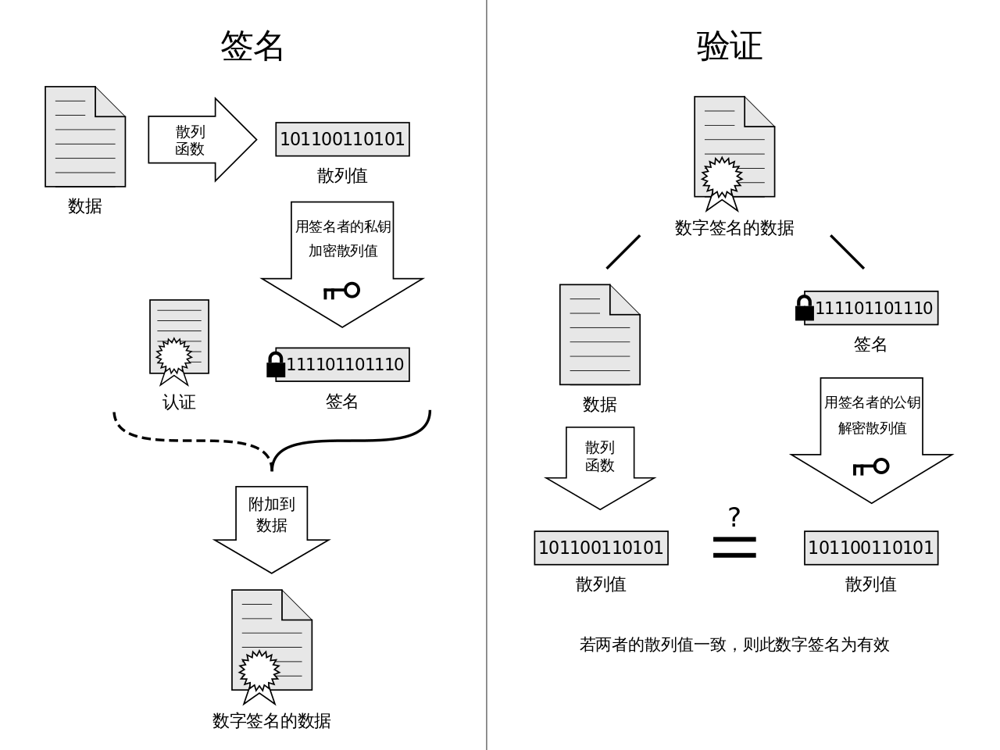

# AppSign
##基础
###证书
1. 证书中包含:
    * 证书的内容(发行者等)
    * 证书的签名(hash(证书内容) + 私钥加密)
    * 证书的公钥

2. 数字证书一般是权威机构CA发布的,Android中是自签名的,CA用自己的私钥加密申请证书者的公钥，并且在证书上附加CA私钥对应的公钥
3. 证书接收者可以用证书上的CA公钥验证证书的完整性(验证证书的签名)，如果CA的证书被伪造了呢?（缺少根证书的验证,根证书的验证被放在了覆盖安装时与前一次APK证书对比来模拟实现）
4. 数字证书能够保证公钥的完整性,没有被修改过(没有办法避免整体替换)

###签名
签名:对内容(文件)进行私钥加密，

验证签名:对内容(文件)进行公钥解密，然后和源文件内容做对比是否一致

目的：能够保证APK文件没有被修改过

###数字签名
数字签名包含：签名 + 证书

如果一个Apk被重新签名并且附加了一个证书则可以通过完整性验证(但是在覆盖安装时，会检查相同包名的应用是否是同一个证书，不同的私钥不可能对应相同的证书)

##Apk签名流程
1. 开发者生成一个自签名的证书;
这个证书是用来证明当前Apk文件是来自开发者自己的,因此采用的是自签名的证书
证书的作用是为了保正一个公钥能完整安全大家传递给Android(不被篡改)
在Apk覆盖安装的过程中会比较前后两个Apk的证书是否一致，如果一致则表示两个Apk都是来自同一个开发者，否则拒绝覆盖安装;

2. 用私钥(数字证书携带的公钥对应的私钥)对Apk进行签名(对描述摘要进行私钥加密)

3. 将签名和证书一起写入到Apk文件中(v1在xxx.RSA, v2在sign block中)

##Apk安装升级验证
1. 验证公钥完整性：验证Apk证书的完整性，确保公钥没有问题

2. 验证Apk完整性：用证书中携带的公钥来验证Apk的签名信息，如果验证签名信息没问题可以确保Apk是完整的

3. 验证开发者：检查已安装的应用中同包名的应用是否证书相同，相同允许覆盖安装，不同拒绝

##签名验证流程图
